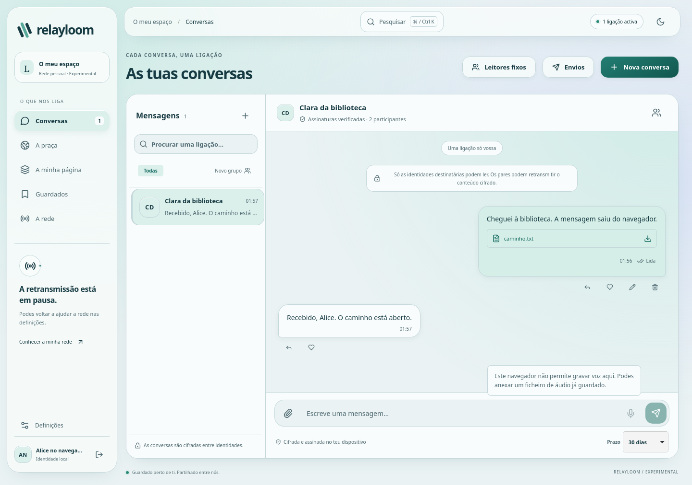

# RelayLoom

Um mensageiro cifrado entre pares, uma rede social e páginas pessoais feitas com blocos declarativos. A mesma interface Liquid Glass serve as aplicações instaladas e a versão web autónoma.

**Experimental, em implementação. O produto não está concluído nem validado para catástrofes.** O contrato integral está em [PROJECT-BRIEF.md](PROJECT-BRIEF.md); funções, plataformas, falhas e pendentes estão em [STATUS](docs/STATUS.md).



A captura vem de um teste real: a autora tinha apenas outro navegador como par; a rota continuava por WebSocket, Reticulum TCP e série PTY. O intermediário não conseguia ler a mensagem. PTY não é rádio físico.

O setup guiado e os idiomas português europeu, inglês e espanhol já estão no URL público. Os gates locais e Android passaram. A verificação final conferiu17ficheirosHTTP e passou10percursosUI, incluindo dois processos independentes. Os timeouts anteriores e a correcção da escolha dehost do verificador ficaram documentados. A validação iOS permanece pendente. [Evidência e falhas](docs/evidence/onboarding-languages/live). [Guia e âmbito](docs/SETUP-LANGUAGES.md) · [Testes executados](docs/evidence/onboarding-languages).

## Usar a web sem instalar a aplicação

**[Abrir RelayLoom no browser](https://johnnypbelo.github.io/relayloom/)** · [Guia para testar em dois dispositivos](docs/WEB-TWO-DEVICES.md).

Abra o endereço em dois dispositivos na mesma LAN alcançável, crie identidades diferentes e troque os cartões públicos. O contacto aparece logo nas conversas. Para estabelecer o caminho, troque o código **e a resposta** em **A rede → Ligar um par**, aguardando a confirmação nos dois lados. Escolha a pessoa em Conversas e envie. O alojamento fornece apenas o código; as mensagens seguem entre pares. Redes de convidados/NAT podem impedir o caminho directo. Não há instalação obrigatória.

O gate local da correcção de ligação passou 67 casos web e nove percursos UI através de Reticulum. O painel acompanha a ligação, permite diagnóstico sem dados privados e liberta tentativas abandonadas. [Evidência](docs/evidence/connectivity-media/web). A publicação foi verificada por hash e por três testes HTTPS, incluindo mensagens/anexo entre processos. A verificação física nos dispositivos do proprietário permanece pendente. Se aparecer a versão antiga, feche todos os separadores RelayLoom e reabra o endereço acima, sem apagar os dados do site.

A publicação HTTPS anterior passou um percurso com processos Chromium e Firefox independentes: mensagens nos dois sentidos, anexo de 63 488 bytes exactos, recibo de leitura e recuperação offline após fechar o emissor. **Não equivale a dois dispositivos físicos testados.** [Evidência do lançamento](docs/evidence/web-launch).

A entrada `/browser/index.html` possui identidade, cofre, worker e armazenamento IndexedDB cifrado próprios. Não usa a API de um daemon para guardar dados ou assinar mensagens. A instalação PWA é opcional e não desbloqueia funcionalidades exclusivas.

Para servir os ficheiros localmente:

```sh
npm ci --ignore-scripts --cache .cache/npm
npm run build
node node_modules/vite/bin/vite.js preview --host 127.0.0.1 --port 4174 --strictPort
```

Abra `http://127.0.0.1:4174/browser/index.html`. O processo distribui apenas o código. Para gerar a distribuição pública separada, use `npm run web:build`; o resultado fica em `dist/public-web`. `npm run web:verify` valida os ficheiros antes de os publicar. O URL acima usa HTTPS obrigatório.

Para ajudar a transportar conteúdo de outros pares, active **A rede → Permitir retransmissão** e ligue outros dispositivos. O estado mostra se ainda faltam pares; na web, mantenha o separador aberto e o perfil desbloqueado. Bluetooth directo e descoberta automática ainda não estão implementados.

Em **A rede → Ligar um par**, troque os códigos de ligação com outro navegador. Também pode obter um convite em **A rede → Ligar um par → Usar a versão web neste dispositivo** na app instalada. Depois escolhe a pessoa e envia normalmente; o meio não é escolhido em cada mensagem.

Mensagens/outbox, leitores fixos, social, colecções, páginas e recuperação têm percursos funcionais. **A autoridade, persistência/outbox e UI dos grupos dinâmicos ainda não estão integradas no browser.** Toda a paridade nativa continua obrigatória. [Uso e limites da web](docs/WEB-APPLICATION.md).

## Estúdio de páginas pessoais

O novo estúdio já está disponível na [versão web](https://johnnypbelo.github.io/relayloom/). Em **A minha página**, permite criar um site com várias páginas, 13 tipos de bloco, colunas aninhadas, galerias, estilos, três modelos e Markdown seguro. Inclui pré-visualização móvel, desfazer/refazer e importação/exportação declarativa. O rascunho é cifrado; publicar guarda o projecto actual e assina o conteúdo, que os leitores podem distribuir sem adquirir autoria.

A publicação foi conferida por hash e passou quatro testes no URL real, incluindo seeding do site com a autora offline e troca de mensagens/anexo entre processos. [Evidência pública](docs/evidence/site-studio/live). Guarde o rascunho, feche os separadores RelayLoom antigos e reabra a página inicial para actualizar, sem apagar os dados.

Esta adaptação inspira-se nos sites distribuídos do ZeroNet, com execução limitada a blocos seguros. Os limites actuais são 12 páginas, 128 blocos, três níveis e quatro imagens com até 2 MiB no total. Na interface publicada ainda faltam contribuições multiutilizador, ficheiros opcionais e controlos de endereços permanentes/revisões. [Como criar e limites exactos](docs/SITE-STUDIO.md).

Na versão web, já pode duplicar páginas completas e alterar a sua ordem. A cópia conserva ligações, imagens e a página inicial, com desfazer/refazer e controlos por teclado/toque. A publicação64363cf da fontebfcb5fc foi conferida em17ficheirosHTTP e12percursosUI. Os gates Node/Go,135casos de browser e Android também passaram. [Evidência e pendentes](docs/evidence/page-organisation).

A correcção para guardar rascunhos web com imagens maiores que 1 MiB passou a regressão nos três motores de browser e nos clientes Node/Go, incluindo recuperação exacta após recarregar. A correcção já está no URL público: 17 ficheiros conferidos por hash e 13 percursos HTTPS passaram. [Testes e limites](docs/evidence/private-values).

O código local Node, Go e browser tem uma API de revisões assinadas: endereço estável, histórico, conflitos explícitos e retoma da mesma publicação após interrupção. O browser guarda catálogo e preparação cifrados em IndexedDB, sem daemon obrigatório. Passaram 66 cenários por motor Chromium/Firefox/WebKit, incluindo transporte real WebRTC→WebSocket→TCP entre browser/Node/Go e um seeder reiniciado com o autor desligado. [Testes, correcções e âmbito](docs/evidence/browser-site-api). Os controlos de revisões ainda não estão no editor publicado; o HTML público continua na fonte 0c6b58a. [API e limites](docs/SITE-REVISIONS.md).

Existe também um [APK Android ARM64 experimental](docs/ANDROID-ARM64.md), construído com a mesma interface. A arquitectura, assinatura e assets foram verificados; a execução num telefone ARM64 ainda está pendente.

## Meios através de Reticulum

O nó Node no Linux integra a referência RNS 1.5.4 e aceita as suas 14 famílias de interfaces internas, com política de isolamento. UDP/Backbone foram exercitados com processos reais; KISS/AX25 com portas série virtuais. O adaptador opcional Bluetooth Nordic UART tem testes com GATT simulado, ainda sem validação de rádio físico. Isto não disponibiliza Bluetooth directo entre browsers nem embebe RNS em todas as apps. [Meios, instalação e limites](docs/RETICULUM-MEDIA.md).

## Executar um nó Node

Requer Node.js 22.13+; os testes actuais usam Node 22 e Go 1.26.8.

```sh
npm run build
npm run dev -- --data .runtime/alice --http-port 4173
```

Abra o URL completo impresso. O fragmento contém a capacidade privada de controlo da interface local; **não partilhe esse URL**. A API escuta apenas em `127.0.0.1` e os dados de execução ficam privados no projecto.

Para outro par:

```sh
npm run dev -- --data .runtime/bruno --http-port 4175
```

Crie as identidades. Copie os cartões públicos em **Definições** e adicione os contactos. Em **A rede → Ligar um par**, use o endereço e a porta de transporte do outro nó. Numa LAN, o listener pode ser configurado explicitamente com `--tcp-host 0.0.0.0 --tcp-port 4242`; a API de controlo permanece local e autenticada. Sem um caminho alcançável, a entrega fica pendente.

## Aplicações instaladas

O desktop executa o seu próprio nó, sem serviço externo obrigatório. Neste Linux, o percurso X11 foi executado:

```sh
ELECTRON_CACHE="$PWD/.cache/electron" node node_modules/electron/install.js
npm run desktop:build
npm run desktop -- --x11
```

[Desktop e pacotes](docs/DESKTOP.md) · [Android](docs/ANDROID.md) · [iOS](docs/IOS.md) · [Núcleo Go](docs/NATIVE-INTEGRATION.md).

Para executar o nó Go no host:

```sh
npm run native:build
.cache/native-app/relayloom --data .runtime/go-alice --http-port 4176 --assets dist/web
```

O arranque imprime a origem e o token de controlo local. Os pacotes Windows/macOS passaram em CI, mas isso não prova execução da GUI, assinatura ou dispositivos. O APK Android anterior tem testes num emulador; não herda automaticamente as alterações seguintes. O ramo WIP iOS já confirmou o fecho do teclado e o envio privado no simulador, mas o teste ainda não selecciona a fotografia visível no picker. O fluxo iOS completo e a assinatura continuam pendentes. [Matriz exacta](docs/STATUS.md#plataformas).

## Transportes e propriedade

TCP, série, WebRTC, WebSocket e o adaptador da implementação real Reticulum/RNS transportam envelopes verificados. As rotas podem atravessar vários adaptadores. Foram exercitados partição/heal, pausa consentida, cópias servidas após desligar a autora, reinício do seeder, corrupção e acesso indevido.

O leitor pode guardar e semear a cópia; editar exige a chave de assinatura da autora. Chaves de leitura e convites de transporte não concedem autoria ou controlo da aplicação. Não há servidor central obrigatório de conteúdo, fontes remotas ou telemetria de execução. Apagar não recolhe as cópias detidas por outros pares.

[Reticulum, licença e limites](docs/RETICULUM.md) · [Prova RTC → browser → WS → RNS → PTY](docs/evidence/rtc-reticulum). Rádios físicos, peering durável, WSS/WAN/NAT e embalagem RNS em todos os SO continuam pendentes.

## Verificar

```sh
npm run build
npm test
npm run test:browser
node scripts/verify-ui.mjs
```

As dependências dos browsers ficam no projecto:

```sh
PLAYWRIGHT_BROWSERS_PATH="$PWD/.cache/playwright" node node_modules/playwright/cli.js install chromium
PLAYWRIGHT_BROWSERS_PATH="$PWD/.cache/playwright" node node_modules/playwright/cli.js install firefox
PLAYWRIGHT_BROWSERS_PATH="$PWD/.cache/playwright" node node_modules/playwright/cli.js install webkit
node scripts/verify-browser-matrix.mjs chromium
node scripts/verify-browser-matrix.mjs firefox
node scripts/verify-browser-matrix.mjs webkit
```

O WebKit deste host precisou de bibliotecas de teste locais verificadas. `python3 scripts/webkit-host-deps.py` prepara-as sem instalar pacotes no SO; o lock é específico de Ubuntu resolute/glibc 2.43. Noutro ambiente, os requisitos têm de ser verificados. Preserve pelo menos 15 GiB livres e execute os builds/gates pesados em sequência.

O marco anterior f378e13 passou **30 testes por engine (90), três UI-RNS por engine (nove), 25 UI Node e 25 UI Go, e execução do pacote Linux**. O gate integral anterior passou 281 Node, Go/race, SQLite C e 58 testes de interoperabilidade. [Comandos, hashes, capturas e limites](docs/evidence/browser-matrix).

Uma observação de fecho RTC no WebKit ainda não tem causa estabelecida; os gates seguintes passaram, mas não se afirma correcção. [Observações abertas](docs/evidence/browser-matrix/known-observations.json).

O gate do novo estúdio passou: 338 testes Node; 16 pacotes Go com race (app executada, restantes cacheados); 5 pacotes SQLite C do host; 60 testes de interoperabilidade; 37 casos por motor Chromium/Firefox/WebKit (111); 26 UI Node e 26 UI Go; build/execução/pacote/execução Linux; 85 casos do gate web público e 2 oráculos; 9 percursos UI-RNS. Os domínios foram conservados após comparação de fontes; a matriz final teve build explícito e hashes dos assets. [Resultados, comandos e falhas corrigidas](docs/evidence/site-studio). Não é validação física nem revisão independente.

## Segurança e continuidade

Ed25519 assina cartões e manifestos; X25519/HKDF/AES-GCM protege as chaves de leitura e conteúdos. O browser usa bibliotecas Noble mantidas para as curvas e Web Crypto para AES/HKDF/SHA; preserva os formatos Node/Go. Cofres usam scrypt/AES-GCM. A recusa de chaves degeneradas tem controlos nos três núcleos. Não há ratchet/forward secrecy, anonimato perfeito ou auditoria criptográfica externa declarada.

Estado e chaves desbloqueadas existem em memória; armazenamento pode ser expulso pelo browser. Notificações, segundo plano, hardware, rotação e keystores têm limitações explícitas. Os sites executam apenas blocos seguros, sem HTML ou scripts arbitrários.

[Arquitectura e ameaças](docs/ARCHITECTURE.md) · [Dependências/licenças](docs/DEPENDENCIES.md) · [Agentes e revisões reais](docs/AGENTS.md) · [Retoma e tarefas pendentes](.codex-delivery/RESUME.md).
